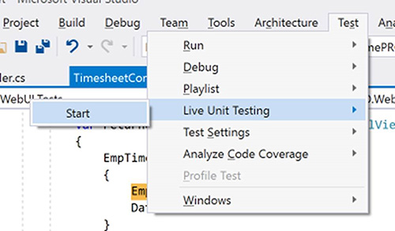
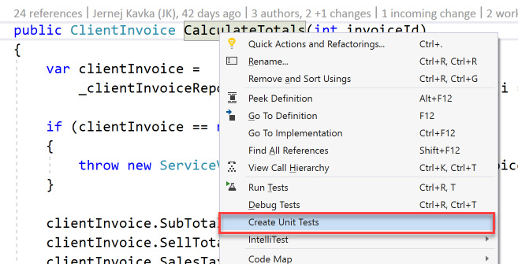
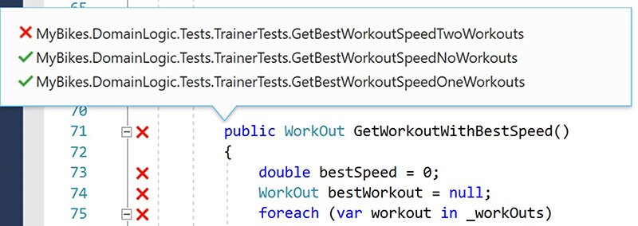

 Visual Studio 2017 introduces a new feature called Live Unit Testing. This gives the developer insight into code coverage of the file that they are working on, so they can quickly and easily see if there’s a unit test that covers the code they are working on.
 ​Figure: Enable it by selecting Test | Live Unit Testing | Start​Figure: Bad Example – This method isn't covered by any unit tests, so the developer should consider writing a unit test for it​Figure: The developer can right click and create a test immediately​Figure: Good Example – Developer can see that the code is covered by 2 passing tests and one failing test
For more details see Joe Morris’s video on .NET Tooling Improvements Overview – Live Unit Testing:

​​

