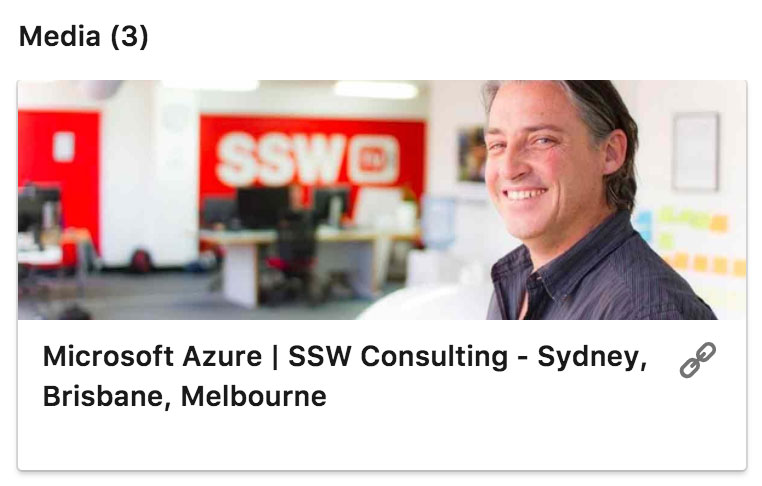

Open Graph is a metadata tag that allows you to control what content shows up when a page is shared on social media networks.
 
It should be placed on the  section of your page. The most used properties are:

 [[badExample]]
|  ](open-graph-bad.jpg) 

**Note: **For LinkedIn you might need to add the prefix as following:

prefix="og: http://ogp.me/ns#" property='og:title' content="Microsoft Azure | SSW Consulting - Sydney, Brisbane, Melbourne"/>

More information and other properties can be found at [http://ogp.me](http://ogp.me/)
