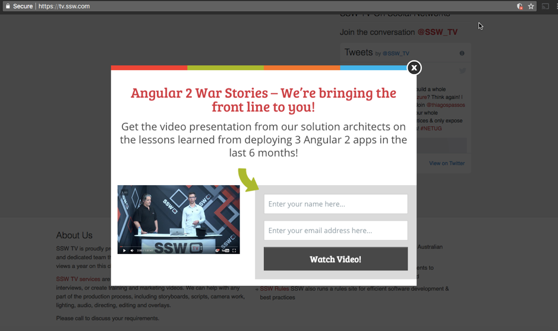

Content marketing is a great way to increase interest in your business and helps to improve lead generation.
 
The best way to achieve this is to use gated content, which requires potential leads to provide their details in order to access the content offered. There are a number of platforms which allow you to create these forms and embed them onto your site.

At SSW we did some research, and after initially using LeadPages, we decided to swap to OptinMonster. This choice was made for a few reasons, OptinMonster is significantly cheaper than LeadPages, and provides all the features we required including; form builders, pop-up forms, mobile friendly, A/B testing and tracking.

[SSWTV](https://tv.ssw.com/)
