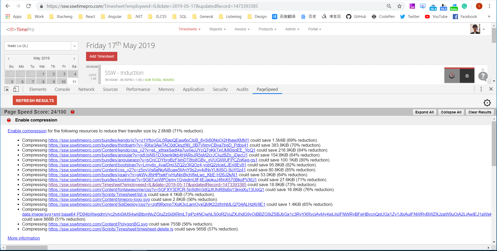

 ​PageSpeed can analyze the performance of your webpages and get specific suggestions on how to optimize them.

 
​**How to install PageSpeed?​​**

Install PageSpeed from https://chrome.google.com/webstore/detail/pagespeed-insights-with-p/lanlbpjbalfkflkhegagflkgcfklnbnh?hl=en-GB
​

Figure:  Install PageSpeed Insights (with PNaCl).

**How to use PageSpeed?**

In Developer Tools (F12), you will have a new tab ​​​named PageSpeed.

Figure: Start your PageSpeed by clicking "ANALYZE".​

The result of the analysis will be displayed in the PageSpeed tab.

Figure: Some files can be compressed more than 80%​

