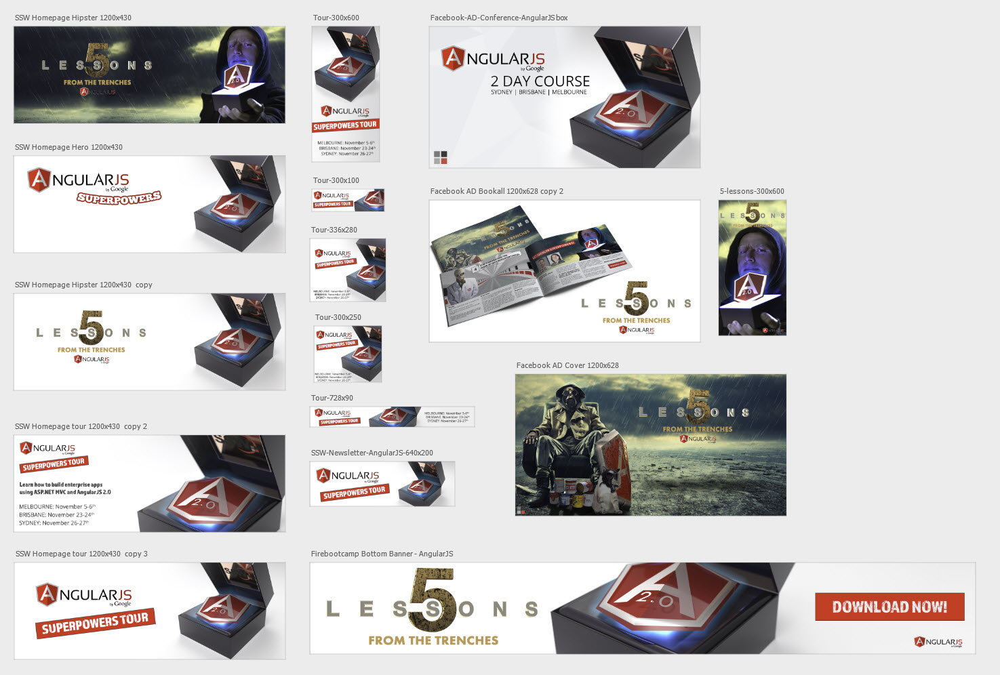

When creating an image (banner, logo, etc) for a campaign, it's important to have consistent sizing and branding. This also allows for images to be created quicker and easier, and in the context of the larger campaign.
 
​Use the Photoshop Artboard to provide a visual guideline and allow for quick and consistent campaign creation.This way, you can see your new banner in the context of the other banners in the campaign, and check that your sizing and art style is consistent.

