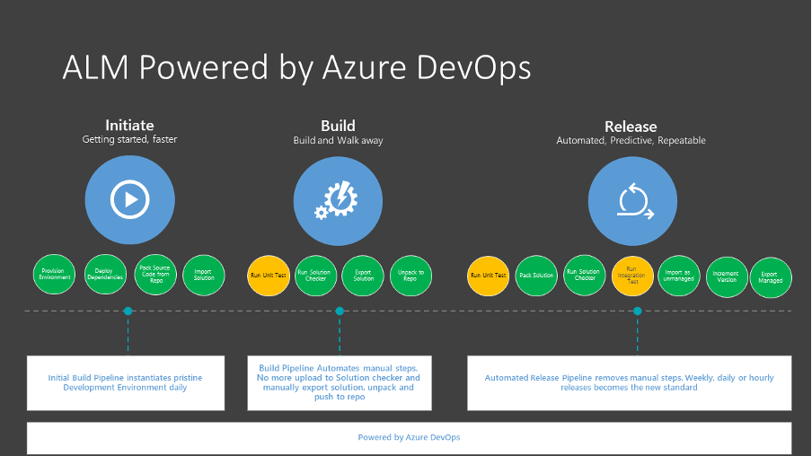

You’ve built your Power App using all the best practices, have multiple solutions that are split into a logical component, you’re using environment variables to handle your configuration data everything is going great! Now it comes time to deploy these changes to the Test environment. Do not deploy these manually. It is a repetitive step and if you have multiple solutions, there will be installation order dependencies that need to be handled, etc. Then the whole process will need to be repeated when you promote the changes to production, rinse, and repeat for the next round of changes for test and production. Highly repetitive, error-prone, and a prime example of automation.

<!--endintro-->

The solution, Power Platform Build Tools:

::: ok  
  
:::

### What do I get with the Microsoft Power Platform Build Tools? 

The Power Platform Build Tools are a collection of Power Platform-specific Azure DevOps build tasks. They automate the manual steps and scripts needed to manage the application lifecycle. There four types of tasks:

* Helper
* Quality check
* Solution
* Environment management

What Power Platform Projects are supported?

* Canvas and Model-Driven Apps
* Power Virtual Agents
* UI Flows and Traditional Flows
* AI Builder
* Custom Connectors and Dataflows

If it can be included in a solution, then it's supported.

More Information here:     https://docs.microsoft.com/en-us/power-platform/alm/devops-build-tools
