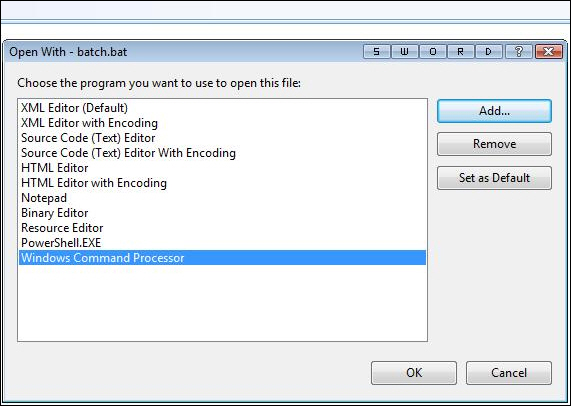

Windows Command Processor (cmd.exe) cannot run batch files (.bat) in Visual Studio because it does not take the files as arguments. One way to run batch files in Visual Studio is to use PowerShell.   
<!--endintro-->

Bad(cmd.exe) for running batch files. 
Good
