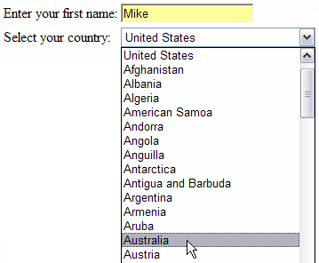
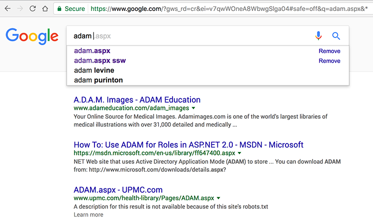

 ​
When getting users to choose data from a medium-long list, or to enter data that has been predefined (such as Country names), it is a good idea to use a predictive-text combo rather than normal combo or text boxes. A good implementation of predictive-text combos will also perform a type-ahead effect, providing the user with a richer experience.
 
Also, predictive textboxes can be used with validation, or without. In instances where you don't mind if users add data to your collection you can turn validation off; however, to keep your collection clean, it is recommended to use validation.
   Figure: Bad Example - Using a Textbox and Combo to enter list data   Figure: Good Example - Predictive-Text combo with Type Ahead   Figure: Good Example - Predictive-Text combo with and without validation
To see this in action [try our Predictive-Text Combos demo](https://www.ssw.com.au/Demos/PredictiveTextCombo/).
  Figure: Best Example - Google search ​

