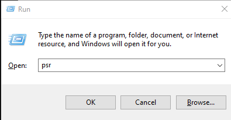
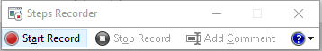
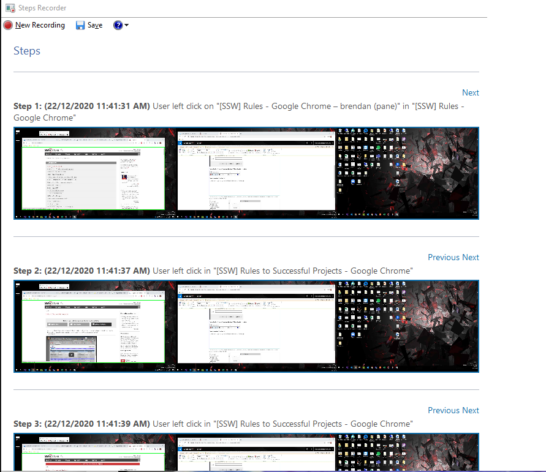

**Problem Steps Recorder** is a useful tool that allows anyone to capture details of a bug. Best of all, It's already installed on your Windows PC!

<!--endintro-->

Bug reports can come from anywhere and anyone - the more people reporting back, the better.

Once a problem has been discovered, it helps to collect as much information as possible. Although there are many useful tools you can give to your test team, Problem Details Recorder has one big advantage: It's shipped with Windows since Windows 7 so anyone can record details of their issue with no preinstalled software.
<dl class="image">&lt;dt&gt;&lt;/dt&gt;<dd>Figure: To start Problem Steps recorder, type PSR into the start | run box </dd></dl><dl class="image">&lt;dt&gt;&lt;/dt&gt;<dd>Figure: then click 'Start Record'</dd></dl>
Once recording, the user can repeat whatever steps to reproduce an issue.
<dl class="image">&lt;dt&gt;&lt;/dt&gt;<dd>Figure: User behavior is captured along with full screenshots. This can be saved and attached to a Bug PBI</dd></dl>
