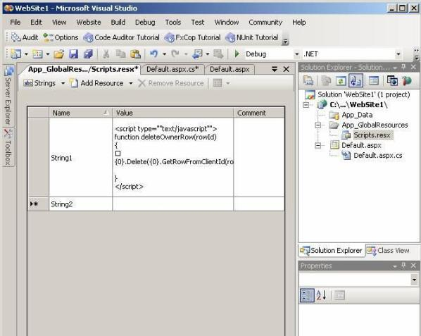
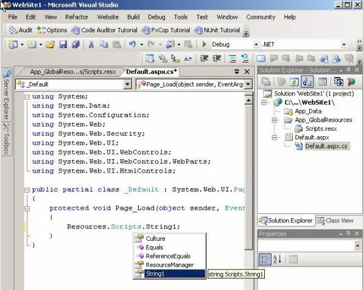

Write a Intro pragraph here<br> 
##  


```
StringBuilder sb = new StringBuilder();     sb.AppendLine(@"");
```

Bad example - Hard to read ?the string is surrounded by rubbish + inefficient because you have an object and 6 strings


```
string.Format(@" ",        OwnersGrid.ClientID);
```

Good example Slightly easier to read ?but it is 1 code statement across 10 lines

```
string scriptTemplate = Resources.Scripts.DeleteJavascript;     string script = string.Format(scriptTemplate, OwnersGrid.ClientID);
```


**Figure: The code in the first box, the string in the resource file in the 2nd box. This is the easiest to read + you can localize it eg. If you need to localize an Alert in the javascript**

 


