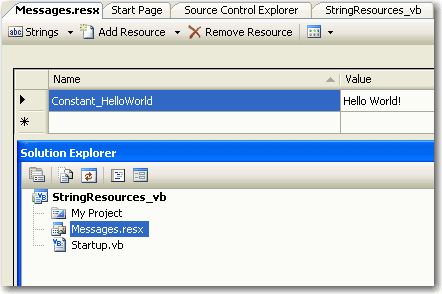

 All message is stored in one central place so it's easy to reuse. Furthermore, it is strongly typed - easy to type with IntelliSense in Visual Studio.
 
Module Startup Dim HelloWorld As String = "Hello World!" Sub Main() Console.Write(HelloWorld)Console.Read() End Sub End Module
Bad example of a constant message Figure: Saving constant message in Resource
Module Startup Sub Main() Console.Write(My.Resources.Messages.Constant\_HelloWorld) Console.Read() End Sub End Module
Good example of a constant message 

​

