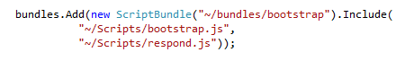
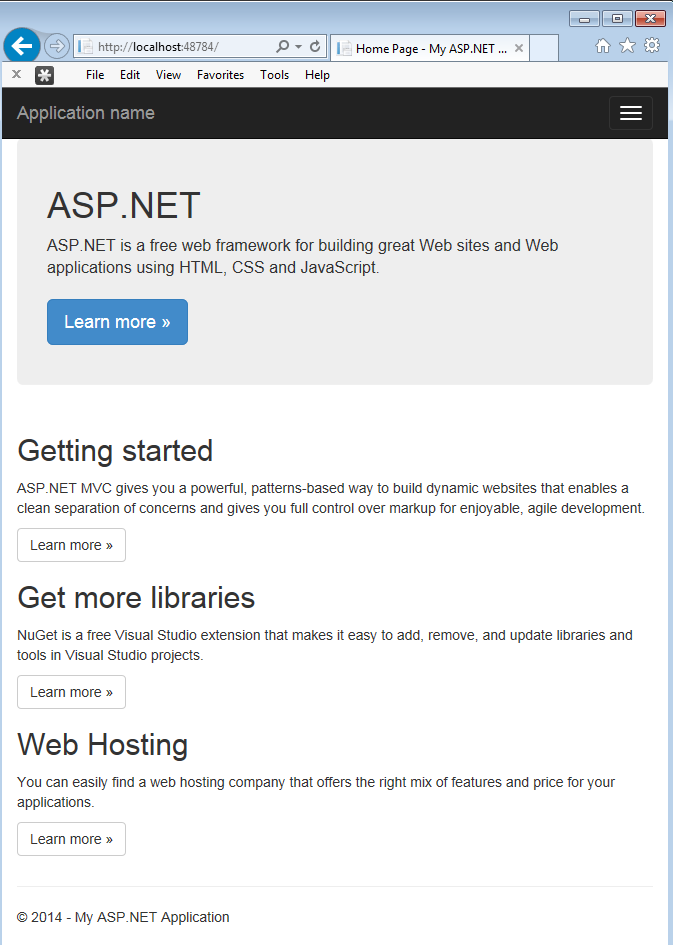

It's great when you can target modern browsers for your web application, but what happens when you want Bootstrap to work in older browsers, such as Internet Explorer 8?
 
Include Respond JS in your application, after Bootstrap. Respond JS enables responsive web designs in browsers which don't support CSS3 Media Queries.

**Note:** Respond JS will be included in a new MVC5 Web Application. If you are working on an existing application, you can get it from NuGet or [https://github.com/scottjehl/Respond](https://github.com/scottjehl/Respond).

