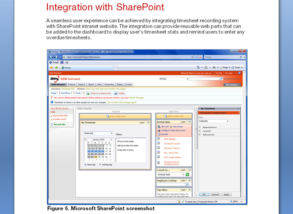

A Picture tells a thousand words. Using screen shots can sell your designs and add confidence to your proposals by giving visual examples of similar projects you have done.​
 
​​Figure: Add a screenshot of a related project​
