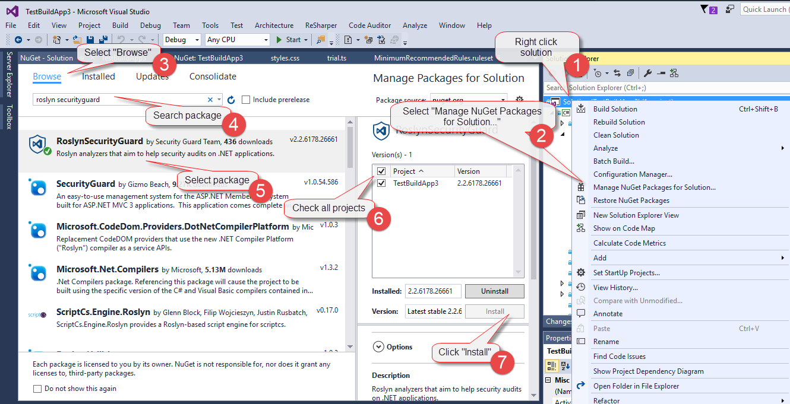
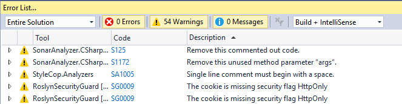
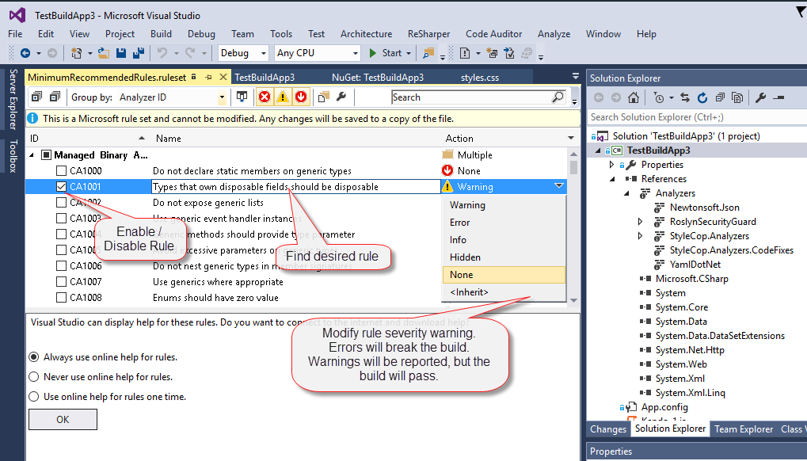
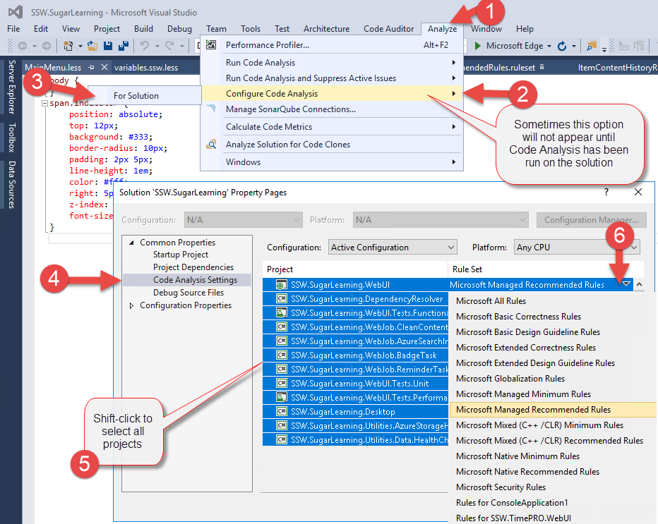

The code quality standard should extend the Visual Studio Analyser. A wide variety of additional analysers can be included via Nuget, the minimum standard should include Roslyn Security Guard, Stylecop.Analysers and TSLint.
 
### Related Steps to Code Health:

- [Do you use the Code Health Extensions in VS Code?](/_layouts/15/FIXUPREDIRECT.ASPX?WebId=3dfc0e07-e23a-4cbb-aac2-e778b71166a2&TermSetId=07da3ddf-0924-4cd2-a6d4-a4809ae20160&TermId=1e14fbd6-0c72-4791-9c79-893de1fdd89e)
- [Do you run the Code Health checks in your VisualStudio.com Continuous Integration Build?](/_layouts/15/FIXUPREDIRECT.ASPX?WebId=3dfc0e07-e23a-4cbb-aac2-e778b71166a2&TermSetId=07da3ddf-0924-4cd2-a6d4-a4809ae20160&TermId=3c2f0b76-038b-47c2-a754-f897f9d502ef)

### Which Packages to Install in Visual Studio

Search & Install the NuGet packages:

- "Roslyn Security Guard" ([Nuget page for Roslyn Security Guard](https://www.nuget.org/packages/RoslynSecurityGuard/)) - Security audit on .NET Applications.
- "StyleCop.Analysers" ([Nuget page for StyleCop.Analysers](https://www.nuget.org/packages/StyleCop.Analyzers/1.0.0)) - Ensures C# code style conformity.
- "tslint" ([Nuget page for tslint](https://www.nuget.org/packages/tslint/)) - Allows for issue tracking of TypeScript projects.

For Visual Studio development on web applications, download Web Essentials, it will provide intellisense for JS, CSS, HTML, Less, Scss, and CoffeeScript. ([Nuget page for Web Analysers](https://marketplace.visualstudio.com/items?itemName=MadsKristensen.WebEssentials20153%E2%80%8B))

Issues from these will now be returned in the Visual Studio analyser error list.

Your goal should be to get the issues in a solution down to zero.
If you believe the issues being raised are not important, please check the section below which outlines how to change the ruleset.

### Modify Visual Studio Analysis Ruleset

The goal is to develop a shared ruleset across projects. (Currently this is just the default settings). This will ensure the same standard and quality of code is maintained across all of the company's projects.
Any project specific rules should be documented in "\_Instructions-CodeHealth.docx" which is to be kept in the solution.
Please also copy the current version number of this rule into the "\_Instructions-CodeHealth.docx" in order to track what version your existing solution adheres to.

The current standard for rules is just the default ones. Frequently check back here for updates to the ruleset definition.

Steps to open Analyser customisation page:
Right Click project > Properties > Code Analysis > Open

