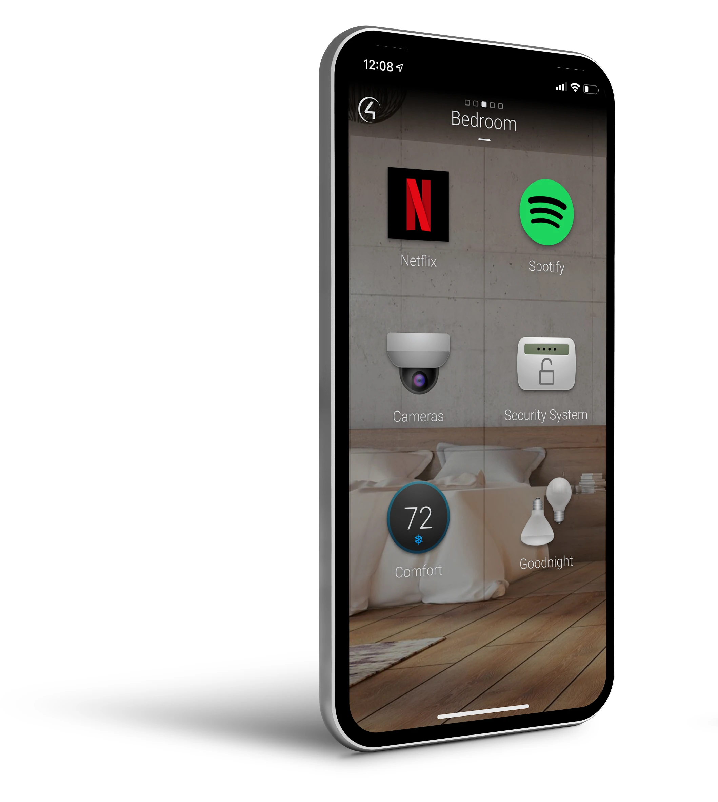

Do you check in on your home or office from your smartphone using the Control4 App?

<!--endintro-->

The Control4 App turns your iOS or Android mobile device into the smart home/office command center. It connects directly to your system and allows you to control and manage all of your system’s features, such as lights, temperature, cameras, audio/video equipment, smart door locks and more.

:::

::: ok
1. Download the app from the App Store: http://www.control4.com/software/control4-app-ios/latest
or Google Play: http://www.control4.com/software/control4-app-android/latest

To use Control4 on your phone and remotely control all services, you will need to follow these simple steps:

### Installing Control4 on your phone

:::

Good Example: Turning on the air conditioner using Control4
::: good

:::

::: ok

:::

Figure: Bad example, using any pysical remote control instead of the Control4 app.
::: bad

:::

::: ok
Throw away your remote controls and move on to technological freedom!

 **Figure: Use the Control4 App** 

> :::
> 
> ::: ok

:::

::: ok

> 3. Contact your SysAdmin to set you up with an account for logging in.
> 
> 
> 
> 
> TIP: The System Name you enter is what the system will be called on your device. It can be anything.
> 5. Use your credentials to sign into Control4.
> 
> 4. Make sure you are on the same WiFi network as your Control4 System and that you have an internet connection.

:::

::: ok
### Changing Users

:::

::: ok

:::

::: ok

:::

::: ok
### Using Control4

> :::
> 
> ::: ok

:::

::: ok

:::

::: ok

> :::
> 
> ::: ok

:::

::: ok

> :::
> 
> ::: ok

::: ok  
  
:::  

> ::: ok  
>   
> :::

> ::: ok  
>   
> :::

:::

::: ok

> :::
> 
> ::: ok
