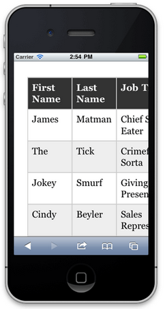

Efficient programmers do not re-invent the wheel. That's why we [use the best Web UI libraries](/do-you-use-the-best-web-ui-libraries).

Twitter Bootstrap is a NuGet Package that provides a jump-start for HTML based projects. It includes the HTML, CSS and JavaScript framework used by Twitter, to build the Twitter site.
 
Building your site on top of bootstrap makes it much easier to have your website look great on devices of all sizes, across many different browsers.
](bootstrap-1.jpg)
Read our [Rules to Better UI (Bootstrap)](/rules-to-better-ui-%28bootstrap%29).

### Documentation

[Bootstrap, from Twitter](https://github.com/twbs/bootstrap)
