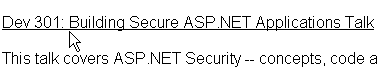

Users expect underlined text to be a hyperlink. Never underline text that isn't a link.

<!--endintro-->

(even!)[Scott Guthrie agrees](http://www.ssw.com.au/ssw/Redirect/Microsoft/ScottGu.htm)
We have a program called  [SSW Code Auditor](http://www.ssw.com.au/ssw/CodeAuditor/Rules.aspx#BreadCrumbs) to check for this rule.
