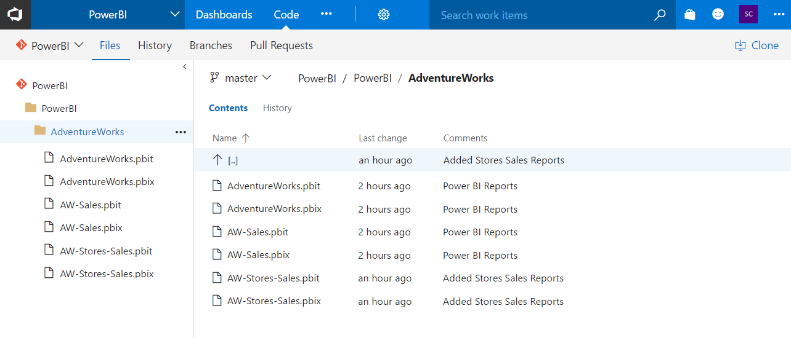
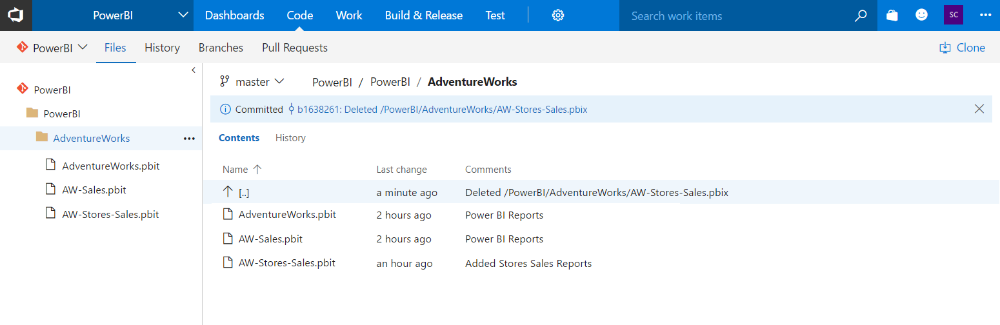
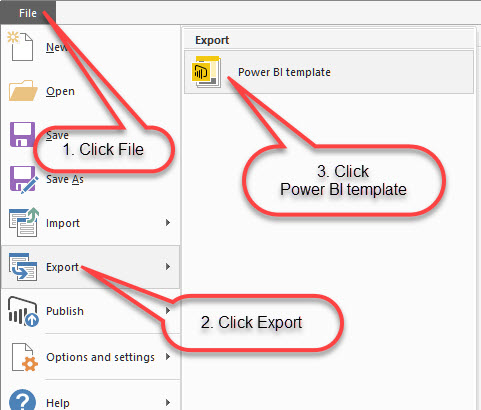
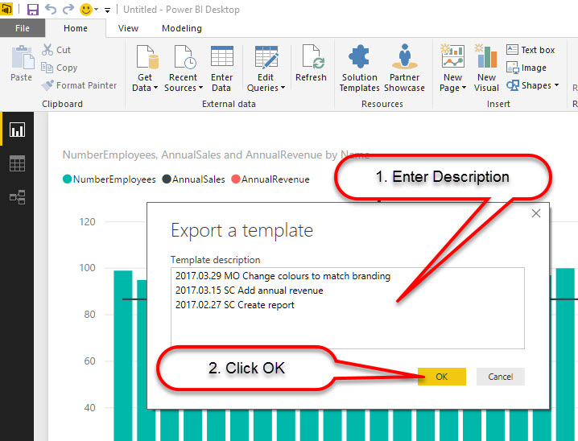
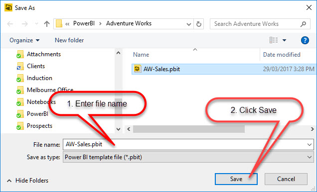

 
​​​​Developers in 2018 have better control history than before.

Prior to the April 2016 update, storing a Power BI Report in version control could be prohibitive, as pbix files contain the dataset and report definition, which in some cases can be gigabytes in size.

The April 2016 update features the ability to export a Power BI Report template (pbit) file, which contains the report definition minus the dataset.

If the pbix file size is not too large, you may choose to store it directly in source control. When a pbix file is very large, then it may be more economical to store the template (pbit file) only in source control.  

Here’s the pros and cons we’ve found for each file type:

 
**Template pbit files** are small, but when you open a template in Power BI Desktop, the dataset needs to reload.  If the changes you need to make to a report are small, waiting for a dataset reload can be frustrating (e.g. waiting 10 minutes for the reload to do a one-minute change). The Power BI pbix file will still be required to publish to Power BI Online.

**Power BI pbix files** can get very large, but when you open them, the data is there and you can immediately make changes to the report. However, if your workplace is geographically dispersed, then upload and download times to/from source control will be a consideration.

Having a mixed set of rules for storing different file types based on their size will quickly get messy if you have a number of reports, so make a decision to go one way or the other based on your environment.​
Figure: Bad Example – Mixed Template and Power BI Files in Source ControlFigure: Good Example – Single File Type in Source Control
To export a template from Power BI Desktop, select File | Export | Power BI template from the menu, enter a description, file name and click save, as per the below figures.
 ​​Figure: Exporting a Power BI Template from Power BI Desktop
Add comments describing the changes made to the report and append to these, in descending order, each time a change is made. This way the history will be at hand each time the template is opened.​
​Figure: Enter a Description for the TemplateFigure: Enter a File Name and Save
Save your pbix file to the same folder as the template above, you’ll need these if you want to publish your report to Power BI Online.

If you’ve decided to store template pbit files in source control, ensure you’ve set your source control application to ignore \*.pbix files.

