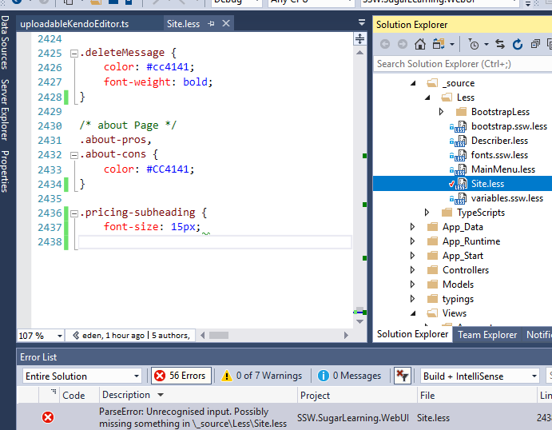
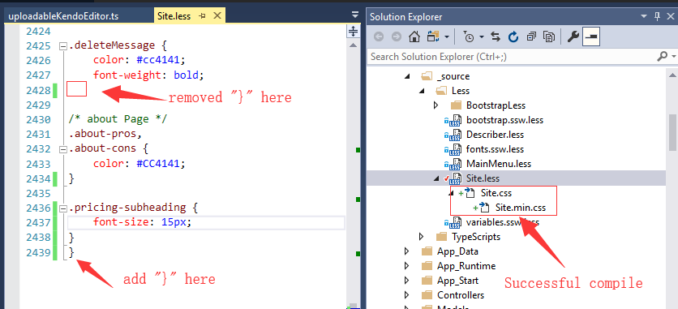
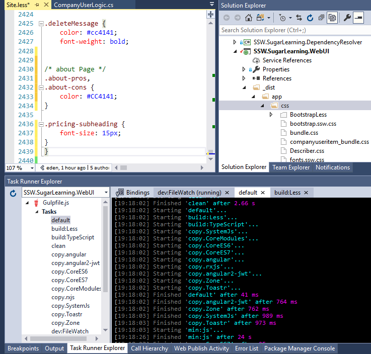

 You can use Visual Studio's Web Compiler extension to create a bundle.css and test if CSS was compiled successfully. 
 
More information and download at [Visual Studio Marketplace](https://marketplace.visualstudio.com/items?itemName=MadsKristensen.WebCompiler).
  Figure: Web Compiler can find missing curly braces Unfortunately different kinds of errors, like are not caught.   Figure: Curly braces in the wrong place, but still compiled successfully 

In addition, Gulp is wrongly successful too:
 Figure: Gulp couldn't find the curly braces error​

