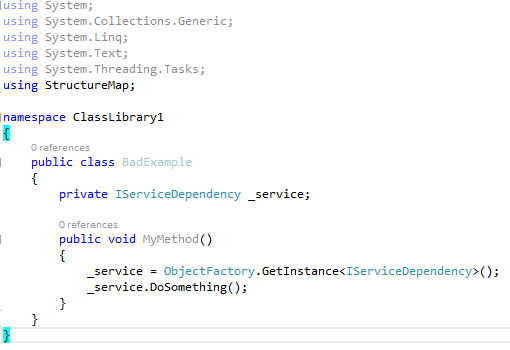

A common practice we see when developers start to use IOC containers is that the IOC container becomes a central service and configuration repository that all the components across the project become dependent upon. 
<!--endintro-->

Using an IOC container in this manner can bring advantages such as centralised configuration and dependency lifecycle and scope managment. If implemented correctly, however, your classes can benefit from the above without any direct dependency on the IOC container itself.

::: bad
Figure: Bad Example - the dependency is manually fetched from the IOC container, This class now has a hard dependency on your IOC container  
:::

::: good
Figure: Good example -  The dependency is enforced via a constuctor parameter. The class does not need to know anything about the IOC container being used and can potentially be reused in different contexts and with different IOC containers.  
:::

For more information and insight on IOC usage, read the following: http://www.devtrends.co.uk/blog/how-not-to-do-dependency-injection-the-static-or-singleton-container
