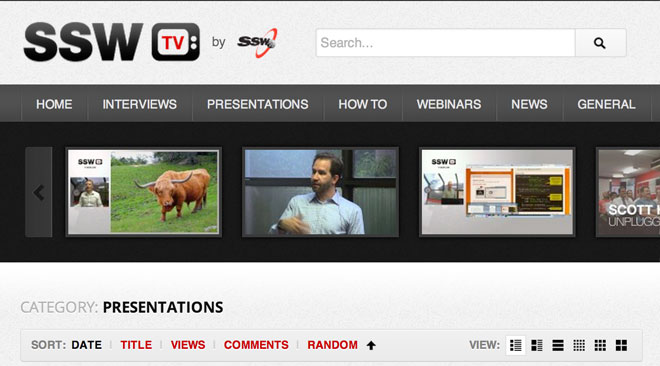

 
The active menu item should stand out from the others. This way you make it easy for users to know where they are at in the website.
 Figure: Bad Example – you can't tell where you are in the siteFigure: Good Example – it’s easy to see where you are at 
