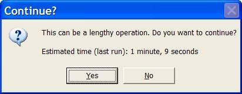

You should never start a long process (>30 seconds) without first giving a warning message to warn the user approximately how long it will take.

[[goodExample]]
| 

You will need to have 2 things:

1. A table to record processes containing the following fields:
    - ALogRecord (DateCreated, FunctionName, EmpUpdated, ComputerName, ActiveForm, ActiveControl, SystemsResources, ConventionalMemory, FormsCount, TimeStart, TimeEnd, TimeTaken, RecordsProcessed, Avg, Note, RowGuide, SSWTimeStamp)
2. A function to change the number of seconds lapsed to words - see the "1 minute, 9 seconds" in the above messagebox - this requires a SecondsToWords() function shown. See our [code base](https://www.ssw.com.au/ssw/Standards/Rules/RulestoBetterCode.aspx#).
