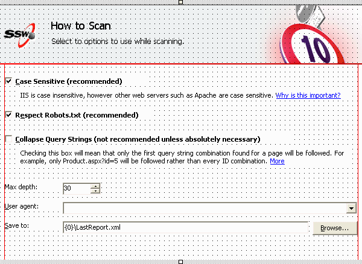

 
Border protection helps us design Windows Forms properly without placing  controls too near to the border. Maintain a consistent alignment makes  the Windows Forms look better, especially on designing wizard forms  where all forms have the same size.
 Figure: Good Example - Good border protection on a form at run time. The only problem is you would have to imagine these blue lines to get consistency
**Border protection in action:**
Figure: Bad Example - Controls placed very near to the border and not aligned correctlyFigure: Good Example - All controls are in the border protection area and aligned correctlyFigure: Design mode
The way to implement border protection (the 2 vertical red lines) is implement it in the base form or base user control, and all other forms and user controls inherit the base class to get consistent border protection lines.


```
private void BaseForm_Paint(object sender, PaintEventArgs e)
            {
                // Draw border protection lines 
                if (this.DesignMode) 
                { 
                   Pen pen = new Pen(Color.Red); 
                   e.Graphics.DrawLine(pen,
                            23, 0, 23, this.Height); 
                            e.Graphics.DrawLine(pen, this.Width - 23, 0, this.Width - 23, this.Height); 
                } 
            }
```


| **Q:** | **Why don't we put a panel on the form and set the form DockPadding property which does a similar thing?** |
| --- | --- |
| A: | <ol><li>Adding more panels docking to a form reduces the performance significantly because of the extra SuspendLayout and ResumeLayout calls.</li><li>In certain cases we might really want a control to stick at the border, if we use DockPadding Property, we can't make any exceptions. And still, these red lines actually just act like a ruler to help us easily see whether the controls are aligned nicely.</li></ol> |


