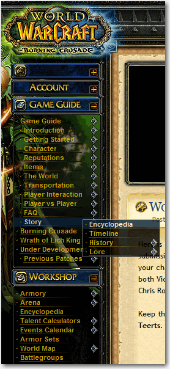

 
Too many sites expect the user to hover and wait to       'discover' if there are sub menus. Use an icon and avoid the       surprises.
 Figure: Good Example - This menu clearly shows which items have submenus
[WorleyParson](http://www.worleyparsons.com/csg/infrastructureandenvironment/resource_infrastructure/Pages/default.aspx) submenus were also designed with this in mind.

