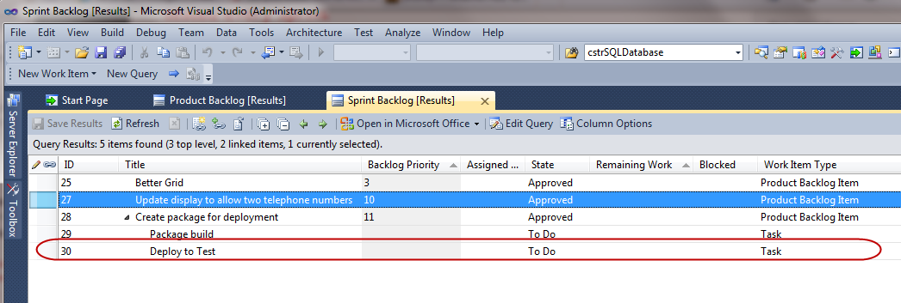
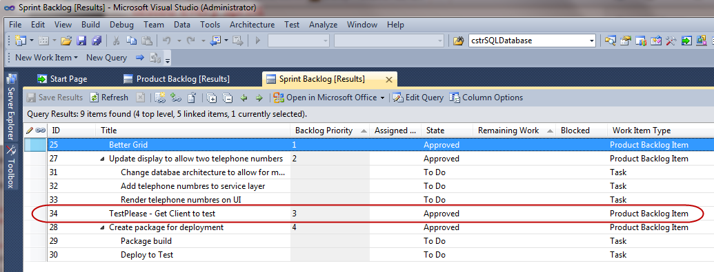
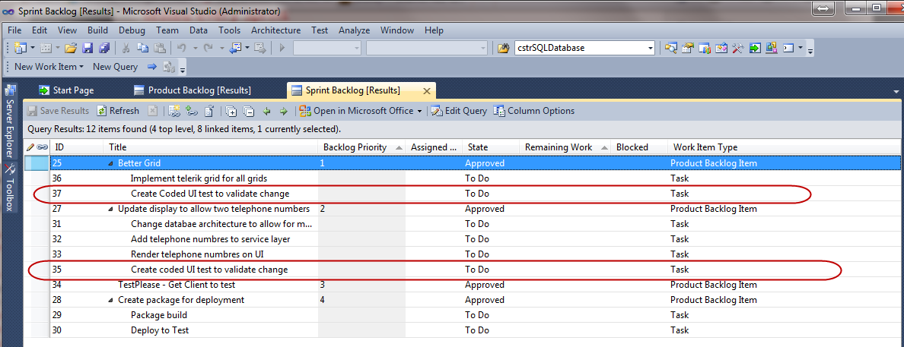
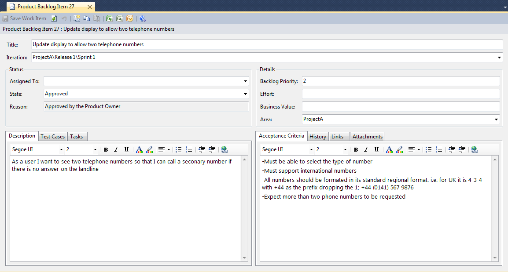

What happens when you leave all the testing to the end of the sprint? You find things that are not  ***done*** and you have no time before the  **Sprint Review** to fix them.

<!--endintro-->

 
::: bad
 **Figure: Bad example - if you don’t complete all the tasks the customer will not receive a build in the sprint** 
:::
One way to mitigate this is to aim for a “ ***test please*** ” to occur a few days before the end of the  **Sprint** but you still run the risk of not having enough time to make sure everything is  ***done.*** 

::: good
 **Figure: OK example – Send the “test please” before the end of the sprint so you have time to finish everything** 
:::

It is preferable to conduct a  **Smoke Test** to make sure that you are comfortable demoing the unit of work you just finished to the customer. One way to do this is to create a Coded UI test for each of the Stories as part of your Definition of Done (DoD) that runs through the functionality you have built.

In this scenario the “ **test please** ” with the customer happens outside of the current Sprint. 

::: good
 **Figure: Good example – Create a coded UI test for each story to prove that it is complete** 
:::

If you are doing  **Scrum** then you should have a  **User Story** fleshed out with a set of  **Acceptance Criteria** . These  **Acceptance Criteria** are agreed with the  **Product Owner** before  **The Team** committed to the story, and define what the  **Product Owner** will accept as complete. This makes it relatively easy to create some automated tests that test for these  **Acceptance Criteria** and help your  **Sprint Review** go as smoothly as possible.

Any changes found during  **the Sprint Review** get added to the  **Product Backlog** to be prioritised by the  **Product Owner** . 

**Figure: Ultimate example – Create a Test (could be Coded UI) for each of the Acceptance Criteria agreed with the Product Owner**
