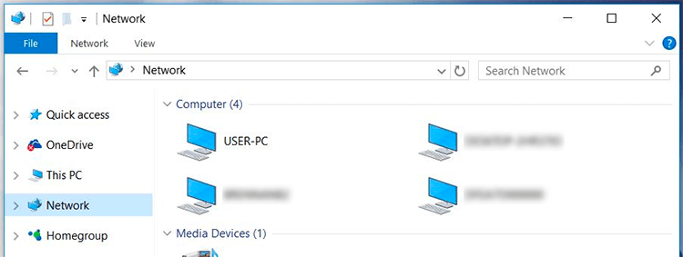
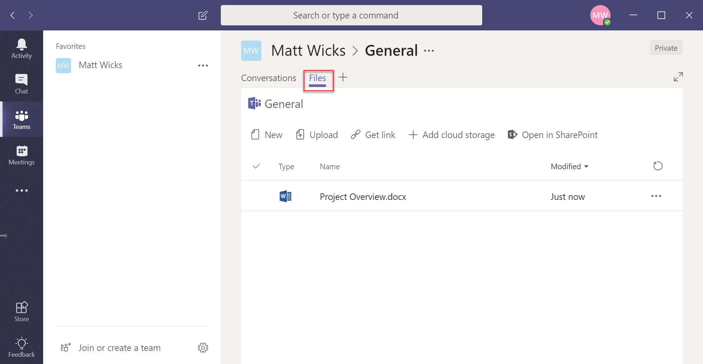
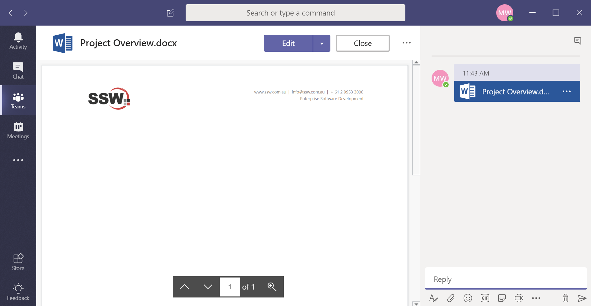
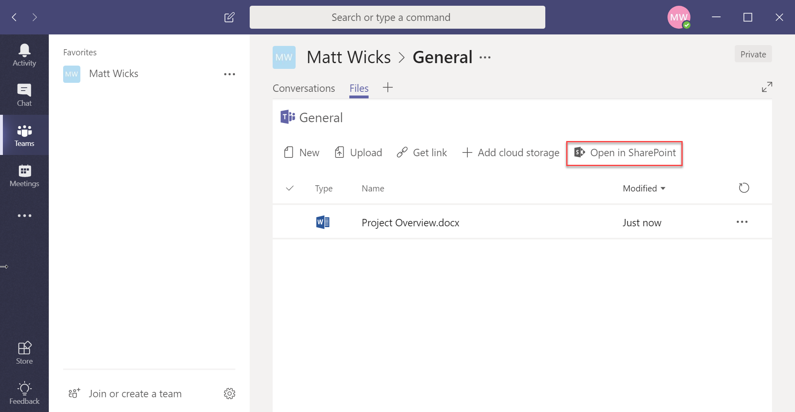
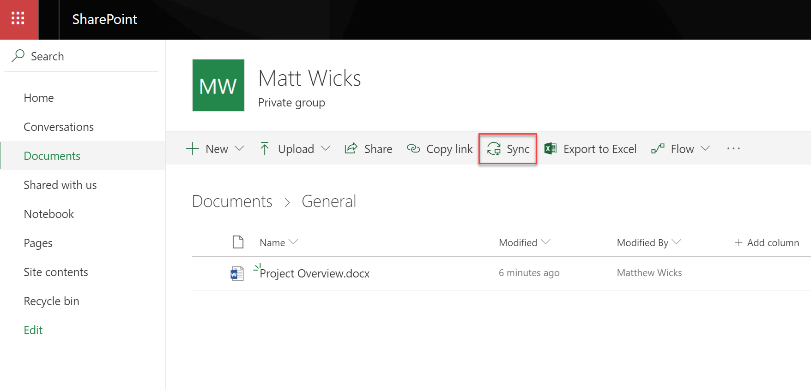

There is a myriad of options to choose from when storing and sharing documents, some examples include:

* SharePoint
* OneDrive or Dropbox or Google Drive
* Microsoft Teams | Team Site

`youtube: https://www.youtube.com/embed/Mna0QBFB6CU`
 

The best choice is Microsoft Teams because it brings together the best of SharePoint, cloud file storage, real time collaboration and more into a single location.

<!--endintro-->

[[badExample]]
| 
[[goodExample]]
| (without leaving the app)
The great thing about having conversations next to the file is that it is always in context. Also, future users can view the conversation when they open the file in teams.

[[goodExample]]
| 
Behind the scenes, storage is provided by a SharePoint site; so that is there if you want to use it. As an added bonus thanks to this; you can take the files offline by syncing with OneDrive for Business and by default each channel gets its own folder.

[[goodExample]]
| 
[[goodExample]]
| 
**Note:** You can add other cloud storage providers for file storage e.g. Google Drive, Dropbox, etc     
This is not recommended - as they aren't first-class citizens i.e. if you want to share files from them, you need to go to the provider's sharing settings outside of Teams

**Warning:** By using Teams instead of SharePoint, you are losing a number of key features:
- No full fidelity support for Metadata in Document Libraries e.g. can’t add extra columns into the “Files” tab
- No support for private channels e.g. you will need a team per subset of users with different permissions
- No direct access to version history from Teams UI (still exists on SharePoint UI)
- No access to the cross-office365 Search feature e.g. SharePoint search is better (see video: https://youtu.be/TiWzzdASVWE)
- No access to external content in the search feature e.g. can’t search rules.ssw.com.au
- No access to SharePoint designer workflows (although the new way to do it is Microsoft Flow)

### Related rules

* [Sales - Do you track all sales related activities in CRM?](/_layouts/15/FIXUPREDIRECT.ASPX?WebId=3dfc0e07-e23a-4cbb-aac2-e778b71166a2&TermSetId=07da3ddf-0924-4cd2-a6d4-a4809ae20160&TermId=aad93e59-5977-466f-8ab5-39b21fbca4dd)
* [Do you integrate Dynamics 365 and Microsoft Teams?](/_layouts/15/FIXUPREDIRECT.ASPX?WebId=3dfc0e07-e23a-4cbb-aac2-e778b71166a2&TermSetId=07da3ddf-0924-4cd2-a6d4-a4809ae20160&TermId=29977bca-11e3-4442-a2e2-29dc23e194ed)
