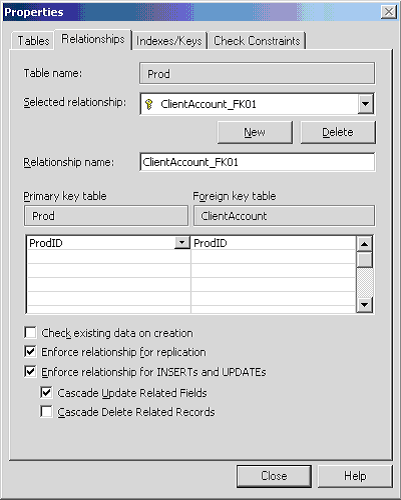
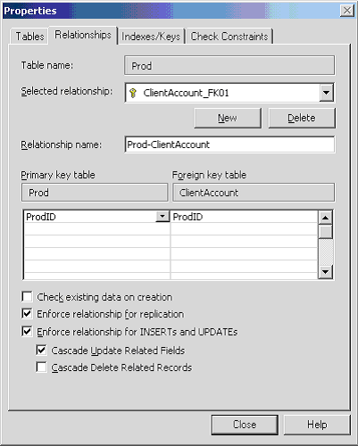
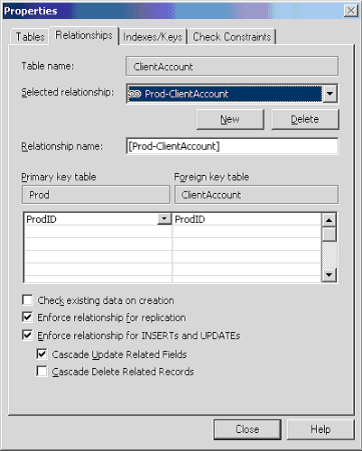

This standard outlines the procedure on naming Relationships at SSW for SQL Server. Use this standard when creating new Relationships or if you find an older Relationship that doesn't follow that standard.

<!--endintro-->

Do you agree with them all? Are we missing some? Let us know what you think.

### Syntax

Relationship names are to have this syntax:
[PrimaryTable] - [ForeignTable]
[        1       ] - [        2       ]

[1] The table whose columns are referenced by other tables in a one-to-one or one-to-many relationship.
Rather than accepting the default value i.e. ClientAccount\_FK01 that is given from upsizing.

::: bad
Figure: Bad Example - using the default relationship name

:::

We recommend using Prod-ClientAccount.

::: good
Figure: Good Example - using a more descriptive relationship name

:::

The good thing is when you look at the relationship from the other side it is there as well.

** 
We also believe in using Cascade Updates - but never cascade deletes.
