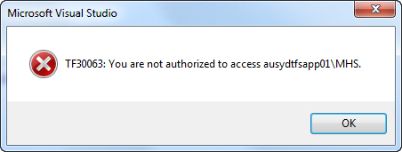
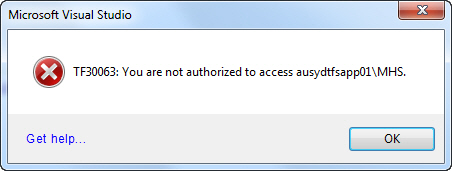

 
Every message box should contain a link to a wiki or KB with more details about the message. In the example of the below error message:
   ​Figure - Bad Example: User now has to Google to find out how to fix this errorFigure - Good Example: If you click on the "Get Help..." link on the bottom of the form it will take you to a wiki page with common issues and resolutions
