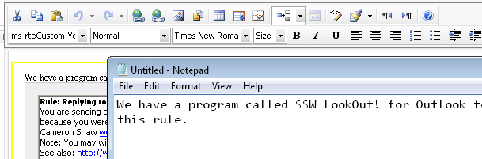
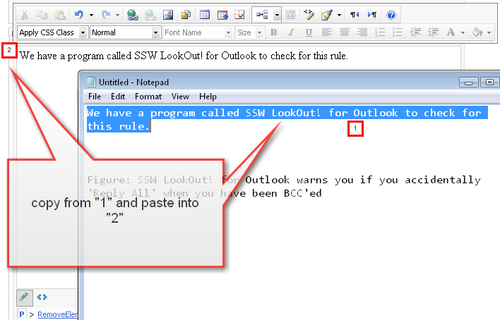
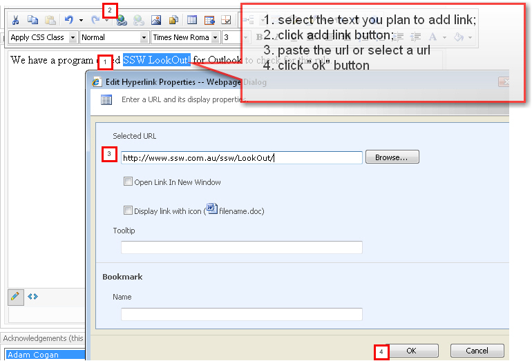
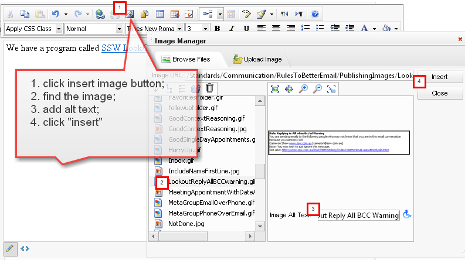
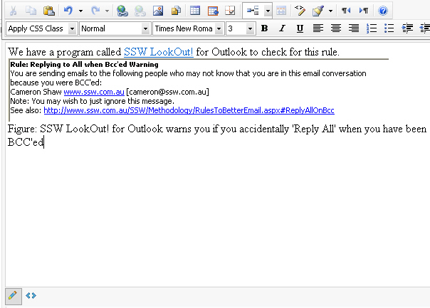
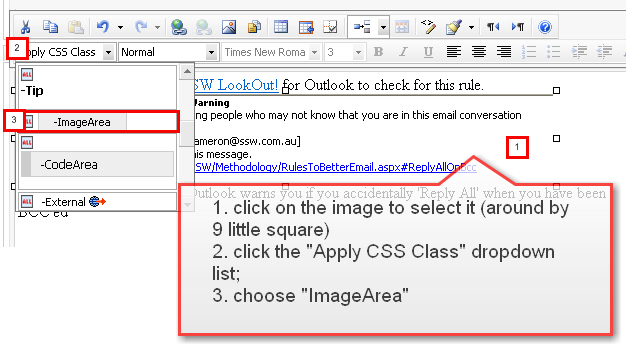
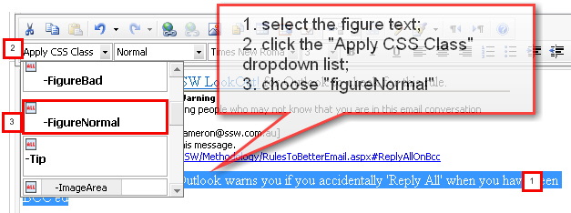
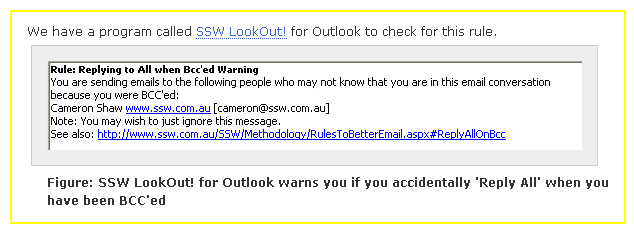

Do you know how to apply style to image, figure..etc?

Let's take the "AvoidReplyToAllWhenBcc" page as example.
  First, the reason to cause the style issue is the style doesn’t apply to right place. Below is the html code after you adjust the figure manually (sorry, still not right ). Please look at the highlight part, 

- the “ms-rteCustom-ImageArea” style doesn’t apply to 
 tag, but wrapped by  with “ms-rteCustom-ImageArea” style;

- there is no style apply to figure;

We have a program called [http://rules.ssw.com.au/WebSites/RulesToBetterWebsitesLayout](/WebSites/RulesToBetterWebsitesLayout)">
         SSW LookOut! for Outlook to check for this rule.

http://rules.ssw.com.au/WebSites/RulesToBetterWebsitesLayout" />

**

             Figure: SSW LookOut! for Outlook warns you if you accidentally 'Reply All' when
             you have been BCC'ed **
 1.  Not sure how user inputs the  content into this page. Anyway, here is the right way to add content via Telerik Editor. Please read below example of how I redo this part in Telerik Editor without changing the code manually

 3. Copy the first sentence from notepad and paste into Telerik Editor in the page; (please avoid copying straightly from web page and pasting them here, it will copy the all tags as well. it might affect the styles which can’t apply correctly )

 8. Apply style to the figure

