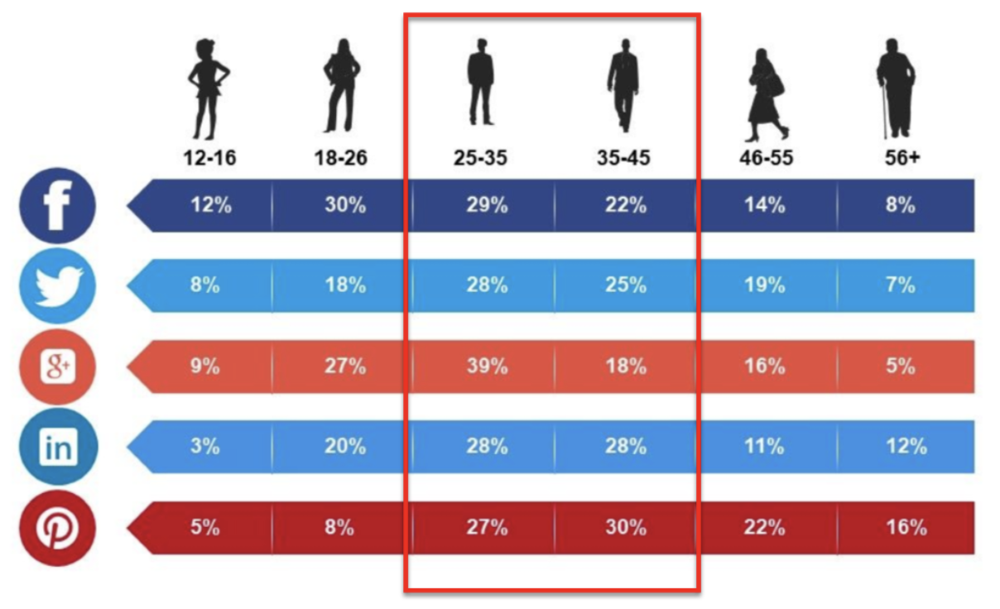
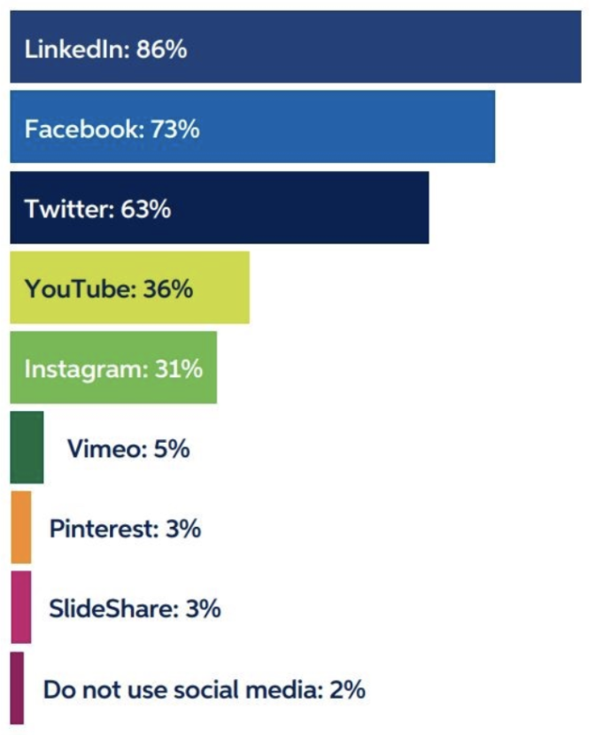

There are so many ways to spend you Marketing Budget these days that it's tempting to do a lot ofdifferent things and spread your budget quite thin across many platforms. In our experience, our budget has always been better spent by picking a few things and then doing them really well. For example, we know that for us, Twitter is great for branding, but not as great at selling our Events or Services. So counter this, we do great free social media posts on Twitter and occasionally spend on targeted ads (to expand our brand), but spend more money on Facebook Ads to advertise our [Training Events](https://www.ssw.com.au/ssw/Events/Training/NET-Core-Superpowers-Tour.aspx), because we know that our audience uses this platform the most for purchases.

<!--endintro-->

Deciding about where to place your budget can be quite confusing, but if you’ve done your homework and identified your potential client through personas, you can work out which platforms to target to hit your audience.  
Using your persons to target your audience will save you a lot of money in the long run, because while you’re not excluding anyone from outside of your target audience, you are honing in on someone most likely to purchase your product or service. 
 
For example, your cost can depend on how wide your audience is if it’s local or international, and more. These details will make it possible to find the right number to align your budget with your marketing goals. Staying focused on your marketing objectives is also part of not overcoming your budget. As an example, new companies invest an average of 12 to 20% on the marketing of gross revenue, while established companies will spend between 6 to 12% of their gross revenue. 

Here are some interesting demographics to consider:

  

  

Interestingly, according to Business Insider Intelligence, despite being one of the most used platforms, Facebooks’ trust ranking has plummeted over the last two years, largely thanks to “Fake News” and data use scandals. LinkedIn remains consistently dominant in the trust rankings and is still growing in size every day.
