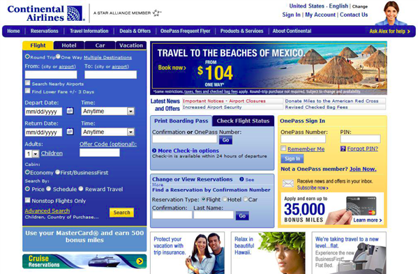
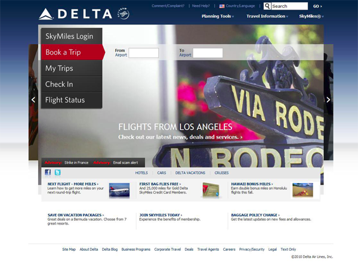
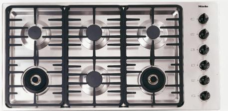
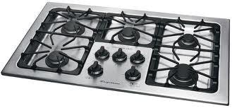

People rarely read word by word; instead, they scan the page, picking out individual words and sentences that seems more relevant.
   ​
It is important to divide information, not show it all at once. The visual organization of information is vital to legibility. When displaying information or controls, designers need to visually convey:

1. Information structure
2. Relation between elements
3. Importance and relevance of elements

[[badExample]]
| 

[[goodExample]]
| 

Another example of scanning, not reading is visually mapping.

[[badExample]]
| 

[[goodExample]]
| 
