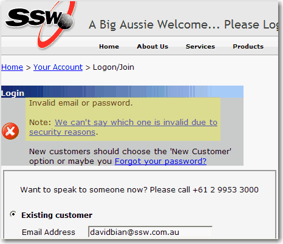

 
When a user fails to sign in due to invalid email or       password, you might have the well intention of letting them       know by telling them exactly which one is invalid.

However this is not secure. It makes it easier for bad guys       (e.g., hacker) to get access to your account and do       malicious things to the site and with your information.

The more secure message should be 'Invalid email or       password'.
 Figure: Good example - for security reasons, you don't say if it was an invalid user name or password.
See     [Login.aspx](http://www.ssw.com.au/ssw/shop/Login.aspx) for a real example.

