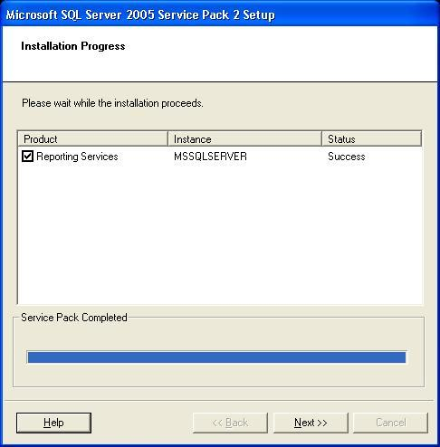

 
Some processes might take a long time to be completed and this can frustrate the user. The best way to avoid this frustration is giving information and options.
   ​Figure: Bad example – this progress bar looks like it is stuck at 99%. Ideally the progress bar should be hidden when completed and replaced by a green tick
