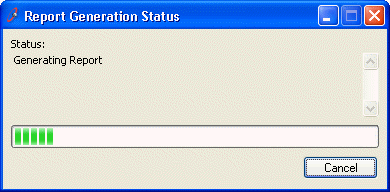
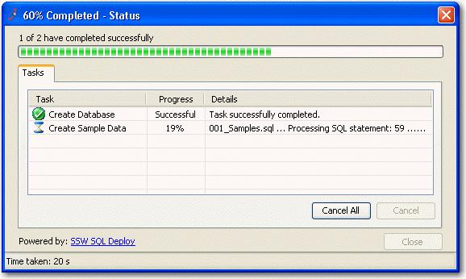

 
The **last** thing a user wants is to be stuck waiting around for a long-running process to finish that they accidentally started in the first place. This heightens frustration with the application because:

- They do not know how long the process will last (adds uncertainty to the user experience)
- They cannot stop the process (creates lack of control in the user experience)

   ​
Instead, keep users happy with your application by:

- Showing status description information above the progress bar
- Allowing the user to stop the process at any time by clicking "Cancel" (or as a minimum, prompt for confirmation before the long running process starts)

Figure: Good Example - Progress Bar with description and Cancel ButtonFigure: Good Example - Progress Bar with description and status, and Cancel Button
We have a product called [SSW .NET Toolkit](http://www.ssw.com.au/ssw/NETToolKit/) which includes these controls. [SSW .NET Toolkit - Using Progress bars/Status forms.](http://www.ssw.com.au/ssw/NETToolKit/08ProgressbarsStatusforms.aspx)

