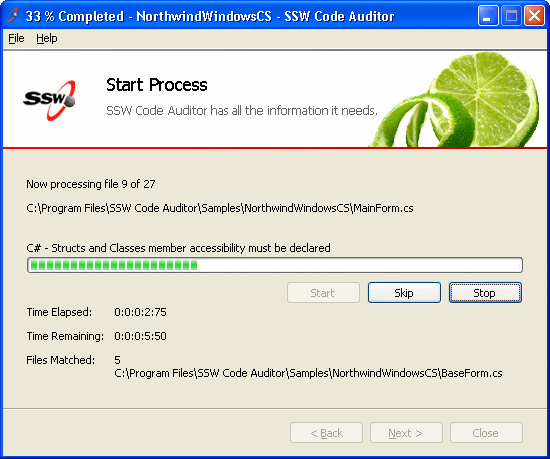

The importance of having the status of progress bar on winform's title:

- Users can clearly see the progress status.
- If the winform is minimized to taskbar, users still can see the progress status.

 
The form title should take the form of "[XX]% Completed - [Task Description] - [Product Name]".
There is another relevant rule about the [winform title](http://www.ssw.com.au/ssw/Standards/Rules/RulestoBetterInterfaces-Windows-Applications.aspx#TitleBarCaption).
](../../assets/BadProgressForm.gif)
