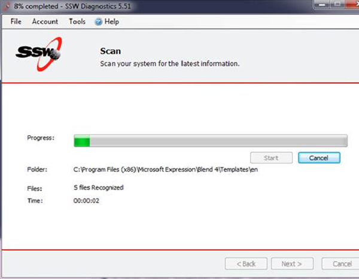

When stopping processes, you should use 'Cancel'... Not 'Stop'. The meaning of 'Cancel' is clearer to users, as opposed to 'Stop' which might also mean 'Pause'.
 
[[badExample]]
| 
[[goodExample]]
| 
