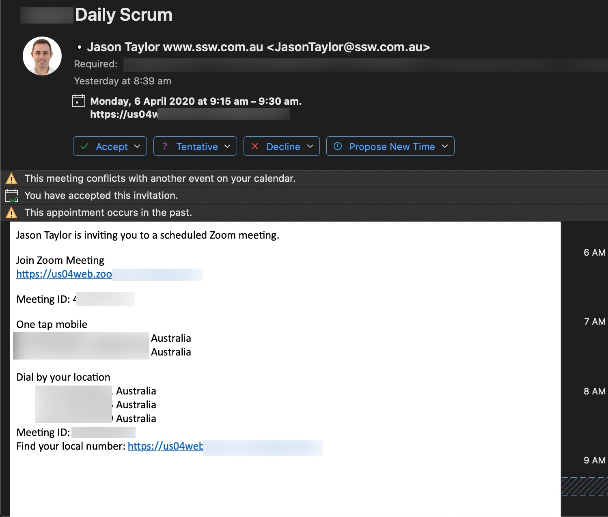
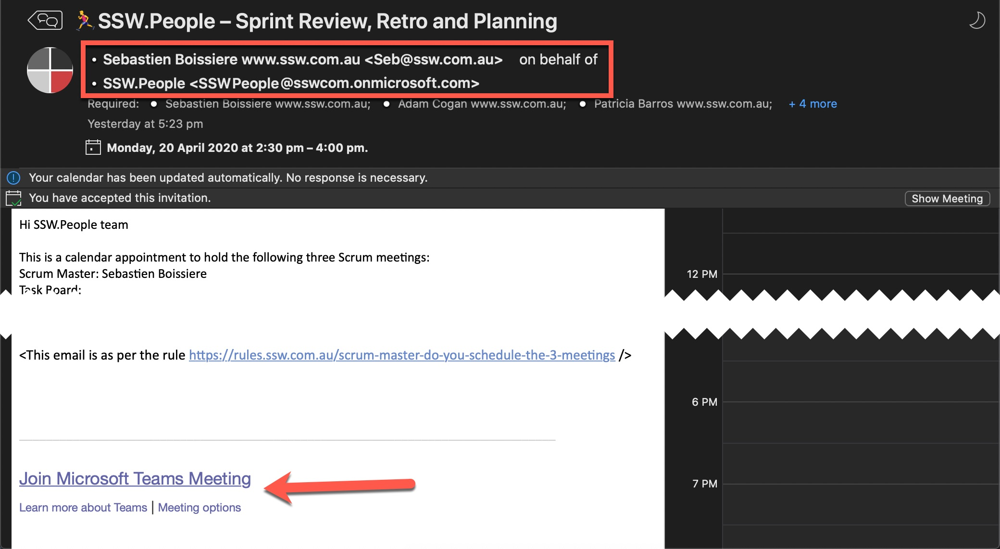
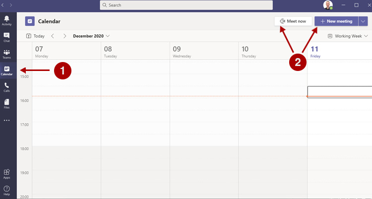
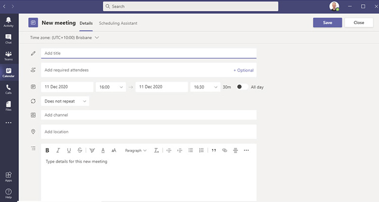
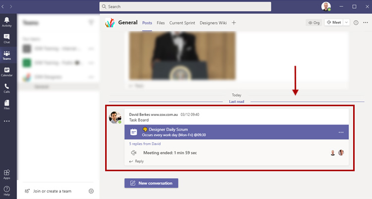

Sending appointments from Teams feels less natural than from Outlook but there are some great benefits:

* Appointment -  You don’t need to remember everyone’s name - The whole team is invited
* Appointment - In the appointment, it auto-generates a link so that everyone goes to the right place to attend
* Visibility - It shows up in Teams Calendar
* Visibility - It appears in the Teams chat (for the channel that was invited)
* Visibility – When the appointment is beginning the app pops up with a button to “Join”
* History - If you decide to record the meeting, the link to the recording shows up in the chat history as well

**Important:** Although the meeting app works great to organize Teamwork such as Scrum meetings or other client meetings, it is not very suitable for more global events such as a retreat or a conference. At SSW we use Microsoft Outlook appointments in those instances.

::: bad  
  
:::  

::: good  
  
:::  

<!--endintro-->

::: ok  
  
:::  

::: ok  
  
:::  

You can select a Channel to meet in and by doing so, members of the Team in which this channel lives will see a Channel activity that you can click to directly jump in the meeting.

::: ok  
  
:::  

Microsoft Teams will also send out an email invitation email for the meeting - this is especially useful when inviting people outside your organization.

### Related rule

* [Do you make your team meetings easy to find?](/do-you-make-your-team-meetings-easy-to-find)
