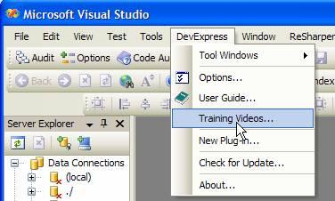

 
Training Videos provide a straightforward way to help the user look into your product and help them have a good understanding. It's better to have a "Training Videos" item in the help menu.
   ​Figure: It's better to provide such a "Training Videos..." menu item
See our suggestion to Visual Studio to [provide "Training Videos" menu item in the help menu](http://www.ssw.com.au/ssw/Standards/BetterSoftwareSuggestions/VisualStudio.aspx#TrainingVideos).

