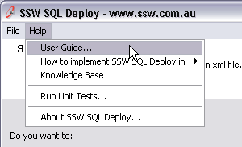
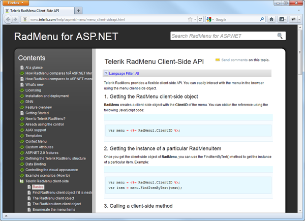

 
Users who are finding your application a little hard to use will always look for a user guide. The first thing they would do is to reach for the help menu. The "About" button can provide a link to the product website, but this is not very handy and obvious for a user who needs quick help. A link to the user guide must be in the "Help" menu.
   ​
There are benefits of having your user guide online:

1. Easier to keep up-to-date and maintain
2. Stats on usage
3. Allows community commenting

Figure: Good Example - "User Guide" link in the "Help" menuFigure: Good Example - Telerik keeps their "User Guide" online
