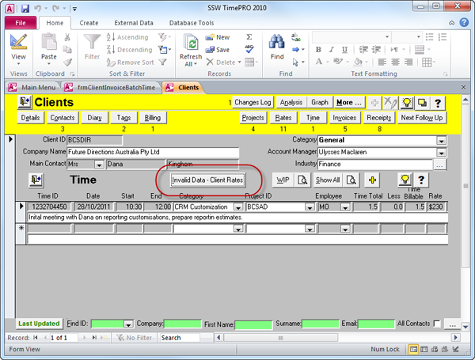

 
A common oversight is applications don't check for invalid data. You should add "Tools | Validate Data" to your application.
   ​
So when you add business rules to the middle tier, consider scenarios such as importing data and any other areas that side step business rules. Therefore we always make validate queries that if they return records, they must be fixed. Examples are:

- For SQL Server we use **vwValidateClient\_MustHaveACategoryID**, or **procValidateClient\_MustHaveACategoryID**
- For Access we use **qryValidateClient\_MustHaveACategoryID**

Figure: Good Example - This application, while not the prettiest, has a handy validation tool to check for incorrect data
# Related Links

[Do you validate each "Denormalized Field" with procValidate?](/do-you-validate-each-＂denormalized-field＂-with-procvalidate)

