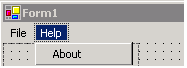
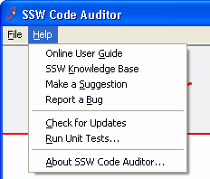

 
A good help menu should have these 8 items in it:

1. Training Videos
2. Online User Guide
3. Knowledge Base
4. Make a Suggestion
5. Report a Bug
6. Check for Updates - [Product Name]
    - Check for Updates - All Programs
7. Run Unit Tests...
8. About [Product Name]...

   ​<dl class="badImage"><dt></dt>
<dd>Figure: Bad Example - Example of a Help menu with only "About"</dd></dl><dl class="goodImage"><dt></dt>
<dd>Figure: Good Example - Example of a Help menu with all 8 items</dd></dl>
