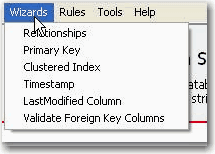
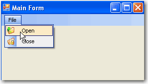

 Plain menu items make your application look normal and less expressive.   ​Figure: Bad Example - Plain menu
While icons can make your application look good.
Figure: Good Example - Menu with icons
# More information

You can use the MenuStrip control in .Net
Figure: the Menuitem has a simple image property
