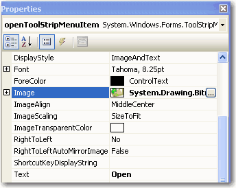

Plain menu items make your application look normal and less expressive.   ​
[[badExample]]
| 

While icons can make your application look good.

[[goodExample]]
| 

# More information

You can use the MenuStrip control in .Net

