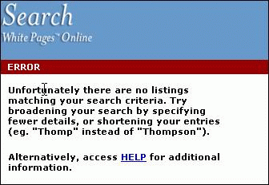
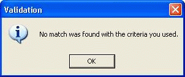

 
If you do a search and no matches are found, display a message indicating zero results were returned rather than an error message.
<dl class="badImage"><dt></dt>
<dd>Figure: Bad Example - No matches found on searching is not an "Error"</dd></dl>   ​
However, a user thinks that either:

1. They have done something wrong (i.e. they are incompetent) OR
2. The software is broken (i.e. your application is incompetent)

Forcing the user into this opinion is a good way to make them avoid using your software in the future.

Instead, use the term "Information" when validation is required.
<dl class="goodImage"><dt></dt>
<dd>Figure: Good Example - Only use "Error" when appropriate</dd></dl>
