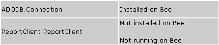
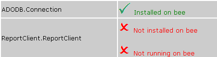
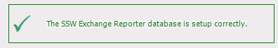
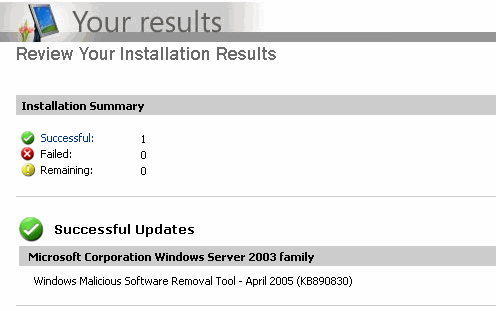

 
When a user looks at a test result, they want to be quickly informed. Therefore, you must make it clear weather the test has passed or failed, or is there any warning.
   ​
- For a pass, the message should be green in color, and a tick next to the message. 
- For a fail, the message should be red in color, and a cross next to the message. 
- For a warning, the message should be yellow/orange in color, and an exclamation mark next to the message. 

Figure: Bad Example - Pass and fail are not clearFigure: Green text and tick for pass, red text and cross for fail (Better)Figure: Good Example - Status on windows formsFigure: Good Example - Microsoft Update uses 3 icons to indicate different status, and good quality of Images too
