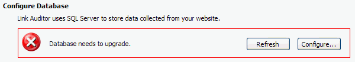

It is very important to use a clear information icon to show the current status. The icon should be consistent with the actual status.
   ​
[[badExample]]
| 

[[goodExample]]
| 

[[goodExample]]
| 

[[goodExample]]
| 

We have another similar rule for Web application - [Do you use icons in web pages to indicate status directly?](http://www.ssw.com.au/ssw/standards/rules/RulesToBetterWebsitesLayout.aspx#StatusIcon)

You can get [SSW's ticks and crosses here.](http://www.ssw.com.au/ssw/standards/images/OurTicksCrosses/browse.aspx)
