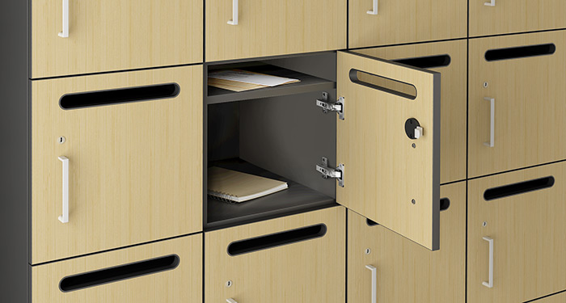
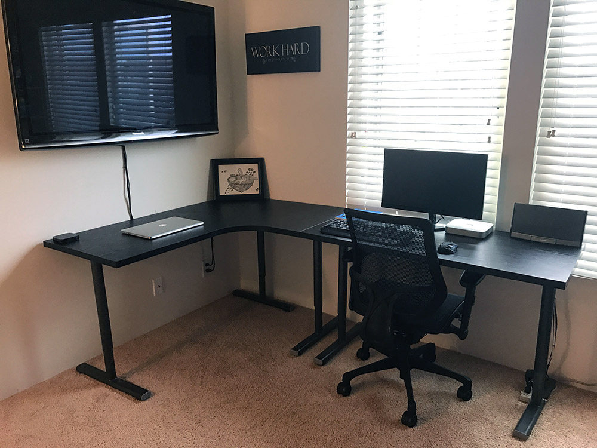

It's important to provide a physical space for each employee to store their stuff and as a bonus they can also receive packages and mail. Lockers should:

<!--endintro-->

* Be clearly labelled with the staff members name
* Ideally, should have a slot for mail
* Ideally should be half-height so you can hang a shirt or a jacket
* Encourage the goal of a clean desk policy
* Encourage the chucking of paper - it should not be a place to keep all of your scraps of papers. Paper tends to get lost and should be transferred to tasks as 'To Myself' emails and then chuck. See[Rules to better Email](/_layouts/15/FIXUPREDIRECT.ASPX?WebId=3dfc0e07-e23a-4cbb-aac2-e778b71166a2&TermSetId=07da3ddf-0924-4cd2-a6d4-a4809ae20160&TermId=9775587d-d391-4b7d-8654-96953eeb9cfc) for more information.

[[badExample]]
| (2 different locations) and larger packages won't fit

::: good
Figure: OK example - Stepped lockers are great as they allow jackets (however missing the mail hole)

:::

Note: At Microsoft Canberra and other offices, they call this "Keep your office in your bag". See the [5S methodology](/_layouts/15/FIXUPREDIRECT.ASPX?WebId=3dfc0e07-e23a-4cbb-aac2-e778b71166a2&TermSetId=07da3ddf-0924-4cd2-a6d4-a4809ae20160&TermId=950fe59d-6cfa-4661-9c87-6b9420cf8e52) Rule for more details.

::: good
Figure: This is how your desk should look when you leave everyday.
:::

:::
Figure: Good example - A locker with mail slot is ideal for both mail and packages
::: good
