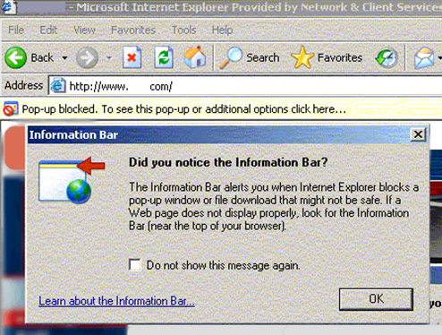
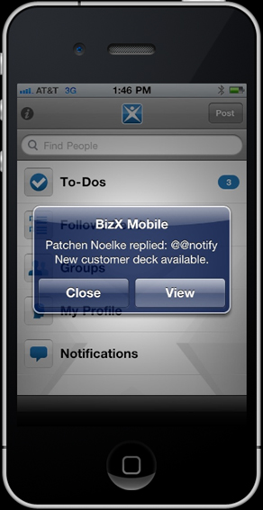

 
Popups are intrusive and ugly.
   ​ Figure: All popups are evil but this may be the most annoying one in history. How ironic that the popup is informing you that IE has blocked a popup.  Figure: Bad Example – Even popups are bad on the iPhone. In iOS5 this style of alerts have been banned (or at least, made optional)
