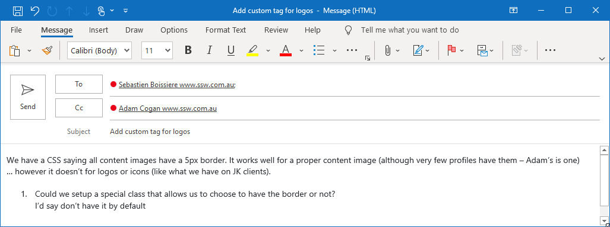
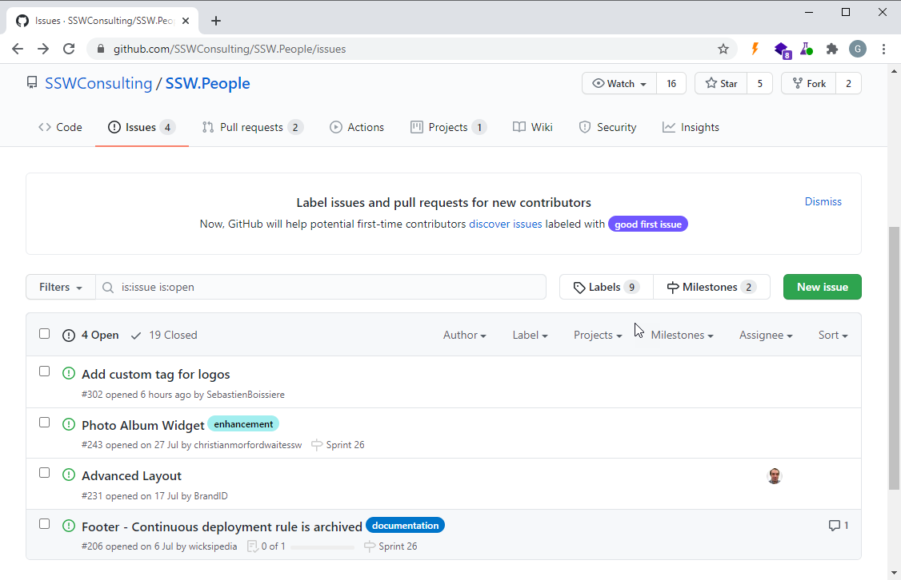
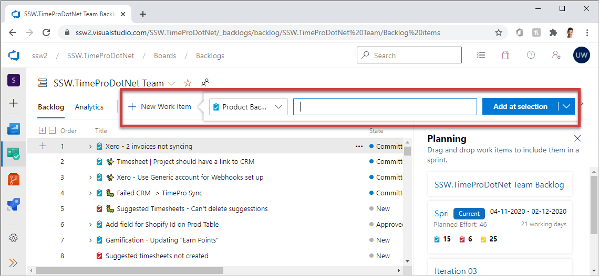

All good Scrum teams have a backlog. The backlog is built by taking a conversation and recording it as one or more Product Backlog Items (PBIs) (e.g. Azure DevOps) or Issues (e.g. GitHub)

We recommend using software such as GitHub Issues, Azure DevOps, or JIRA to store PBIs straight after or, better yet, during the conversation, rather than using emails that may never be entered into the backlog.

The Product Owner is responsible for owning the Product Backlog. See the video on     ["Do you know how to be a good Product Owner?"](/_layouts/15/FIXUPREDIRECT.ASPX?WebId=3dfc0e07-e23a-4cbb-aac2-e778b71166a2&TermSetId=07da3ddf-0924-4cd2-a6d4-a4809ae20160&TermId=a91de77d-a8dd-40be-b61a-bd6305e7183f)

<!--endintro-->

1. **Emails** 

2. **GitHub Issues (Recommended)** 
[[goodExample]]
| 
3. **Azure DevOps** - E.g. https://ssw.visualstudio.com        
[[goodExample]]
| 

* [What's next? Discuss the backlog](/_layouts/15/FIXUPREDIRECT.ASPX?WebId=3dfc0e07-e23a-4cbb-aac2-e778b71166a2&TermSetId=07da3ddf-0924-4cd2-a6d4-a4809ae20160&TermId=148bec81-80b2-4aeb-ab59-fa6123906b90)
* [What to do when it's done?](/_layouts/15/FIXUPREDIRECT.ASPX?WebId=3dfc0e07-e23a-4cbb-aac2-e778b71166a2&TermSetId=07da3ddf-0924-4cd2-a6d4-a4809ae20160&TermId=d0a87319-837c-417d-9a16-3ffecb734a17)
