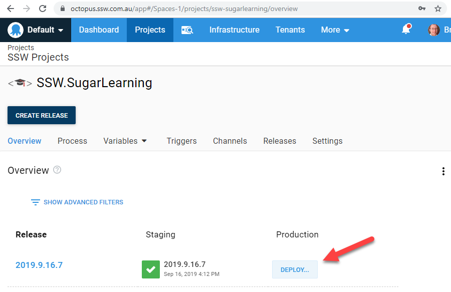

In order to ensure the quality of the code you deploy, make sure you don't deploy                     until you have got your code fully tested and received a "test passed".

There is more than one potential successful path to get work from "In Progress" to "Done" - what's important is that this process is consistent for a project and the whole team follows this process.
The Scrum Definition of Done is a great tool to document and promote this consistency, and the Sprint Retrospective meeting is the perfect opportunity to review and refine this document.

Here are some examples:

* In some teams, the client directly participates in the Scrum team by testing PBIs as they are completed. In this scenario, a good approach is for these testers to be the only users that can mark a PBI as 'Done' on the Azure Devops task board.
* With automated deployment tools such as Octopus deploy you can give your client direct control over deployment resposibility by controlling access rights to the "Deploy to Production" button.

::: good
Figure: Giving clients sole access to the deploy button, allows them to take ownership of the decision to deploy. 

:::

<!--endintro-->

For more information on this, see [Rules to Successful Projects](/do-you-conduct-a-test-please-internally-and-then-with-the-client).
